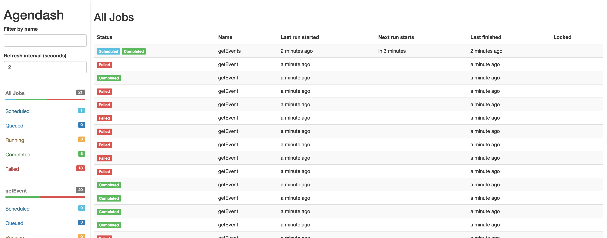
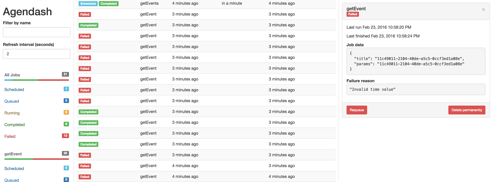

<p align="center">
  
</p>
<h1 align="center">
  timecloud-front
</h1>
<p align="center">
  A distributed scheduling system based on Node.js (front)
</p>

### Features

- Job status auto-refreshes (2-second polling by default)
- Schedule a new job from the UI
- Dive in to see more details about the job, like the json data
- Requeue a job (clone the data and run immediately)
- Delete jobs (Useful for cleaning up old completed jobs)

### Notes

 - Automatically creates additional indexes on several columns (See #24).

---

### Screenshots



---



---

### Install

```
npm install --save timecloud-front
```

*Note*: `Timecloud` requires mongodb version >2.6.0 to perform the needed aggregate queries. This is your mongo database version, not your node package version! To check your database version, connect to mongo and run `db.version()`.

### Standalone usage

Timecloud-front comes with a standalone Express app which you can use like this:

```bash
./node_modules/.bin/timecloud-front --db=mongodb://localhost/timecloudDb --collection=timecloudJobs --port=3001
```

or like this, for default collection `timecloudJobs` and default port `3000`:

```bash
./node_modules/.bin/timecloud-front --db=mongodb://localhost/timecloudDb
```

If you are using npm >= 5.2, then you can use [npx](https://medium.com/@maybekatz/introducing-npx-an-npm-package-runner-55f7d4bd282b):

```bash
npx timecloud-front --db=mongodb://localhost/timecloudDb --collection=timecloudJobs --port=3001
```

### Middleware usage

Timecloud-front provides Express middleware you can use at a specified path, for example this will
make Timecloud-front available on your site at the `/dash` path. Note: Do not try to mount Timecloud-front
at the root level like `app.use('/', Front(core))`.

```js
let express = require('express')
let app = express()

// ... your other express middleware like body-parser

let Core = require('timecloud-core')
let Front = require('timecloud-front')

let core = new Core({db: {address: 'mongodb://127.0.0.1/timecloudDb'}})
// or provide your own mongo client:
// let core = new Core({mongo: myMongoClient})

app.use('/dash', Front(core));

// ... your other routes

// ... start your server
```

By mounting Timecloud-front as middleware on a specific path, you may provide your
own authentication for that path. For example if you have an authenticated
session using passport, you can protect the dashboard path like this:

```
app.use('/dash',
  function (req, res, next) {
    if (!req.user || !req.user.is_admin) {
      res.send(401);
    } else {
      next();
    }
  },
  Front(core)
);
```

Other middlewares will come soon in the folder `/lib/middlewares/`.
You'll just have to update the last line to require the middleware you need:

```js
app.use('/timecloud', Front(core, {
  middleware: 'koa'
}));
```

### Additional options

The second argument to Timecloud is an optional object. Valid keys are:

- `middleware`: Currently only `'express'` is supported. I'd like to use `'koa'` soon.
- `title`: Defaults to `"Timecloud"`. Useful if you are running multiple Timecloud pools.
